This repository collects the presentations, infographics, and mind maps explaining
the **"Provable Porting Engine"** &mdash; a deterministic, agentic approach to migrating
legacy SAS databases and Excel spreadsheets at scale. The materials contrast *Agentic
Engineering* with *vibe coding*, showing how deterministic orchestration, strict LLM
bounding, and mathematical testing can turn a multi-year migration into a provably
accurate, overnight automated run.

## 📊 Presentations

Click a thumbnail to open the full slide deck (Google Drive).

| Slides | Presentation |
|--------|--------------|
| <a href="https://drive.google.com/file/d/1IiEw-A5KzNgOIW7Pv6hYIzObj5wm3x4c/view?usp=sharing">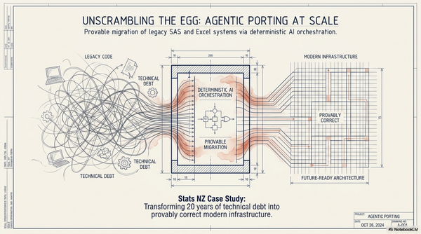</a> | **[Agentic Porting at Scale](https://drive.google.com/file/d/1IiEw-A5KzNgOIW7Pv6hYIzObj5wm3x4c/view?usp=sharing)** *"Unscrambling the Egg."* The Stats NZ case study &mdash; provable migration of legacy SAS and Excel systems via deterministic AI orchestration, transforming 20 years of technical debt into modern infrastructure. |
| <a href="https://drive.google.com/file/d/1LhM_Nx6sJMSNVJvbfm5Fenr8pO9N_Dgs/view?usp=sharing">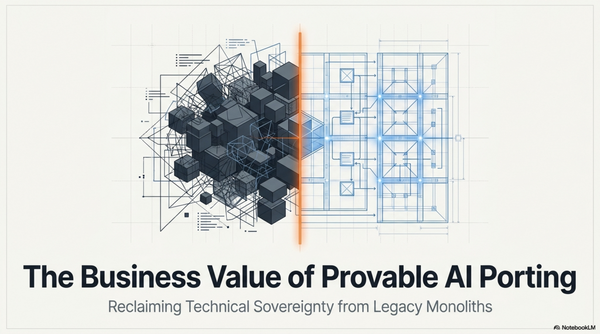</a> | **[Provable AI Porting](https://drive.google.com/file/d/1LhM_Nx6sJMSNVJvbfm5Fenr8pO9N_Dgs/view?usp=sharing)** *The Business Value of Provable AI Porting.* The executive / business case for reclaiming technical sovereignty from legacy monoliths. |
| <a href="https://drive.google.com/file/d/1_aGNN9WJs6xmi7Vvgnnl3K1TszyUfuHH/view?usp=sharing">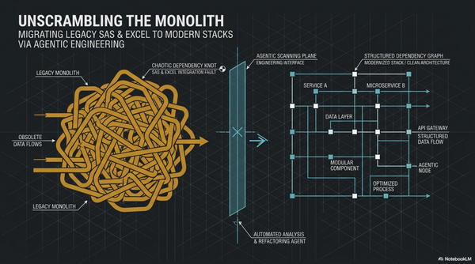</a> | **[Unscrambling the Monolith](https://drive.google.com/file/d/1_aGNN9WJs6xmi7Vvgnnl3K1TszyUfuHH/view?usp=sharing)** The comprehensive explainer &mdash; migrating legacy SAS &amp; Excel to modern stacks via agentic engineering. |
| <a href="https://drive.google.com/file/d/1cIfnwdkK3EALp-QxU-o-zw8Kme_Yb2-2/view?usp=sharing">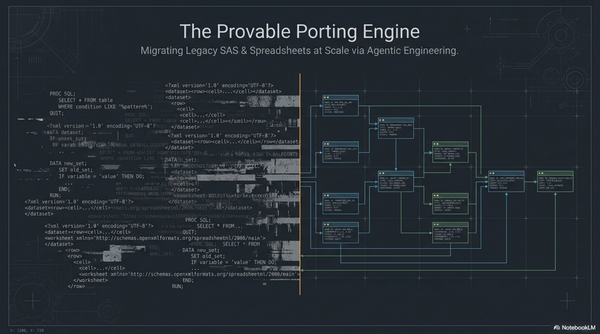</a> | **[The Provable Porting Engine](https://drive.google.com/file/d/1cIfnwdkK3EALp-QxU-o-zw8Kme_Yb2-2/view?usp=sharing)** The technical deep dive &mdash; migrating legacy SAS &amp; spreadsheets at scale via agentic engineering. |

## 🎥 Talks &amp; Videos

Click a thumbnail to watch on YouTube.

| Video | Talk |
|-------|------|
| <a href="https://youtu.be/nmGCJYMgRTc">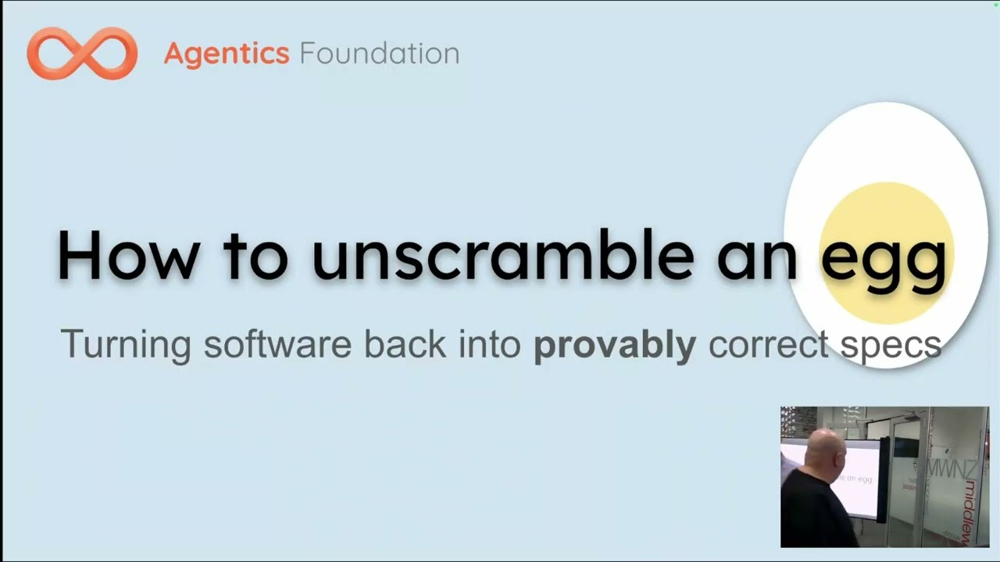</a> | **[AI Agents Transform Legacy Code: How to unscramble an egg](https://youtu.be/nmGCJYMgRTc)** Agentics NZ &mdash; turning software back into provably correct specs. |
| <a href="https://youtu.be/SZKJ5-kdaig">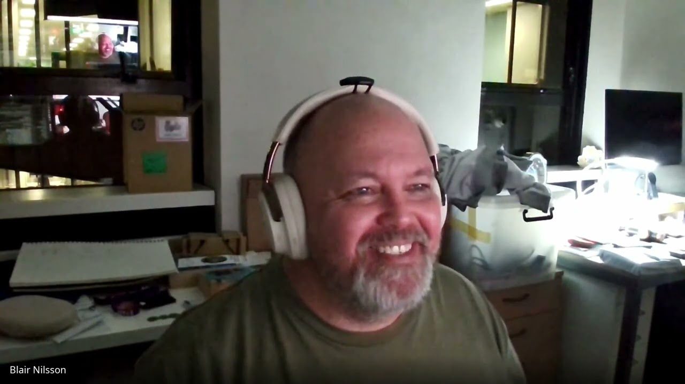</a> | **[Blair Nilsson's Provable Porting Engine](https://youtu.be/SZKJ5-kdaig)** Agentics NZ &mdash; migrating legacy SAS &amp; spreadsheets at scale. |

## 🖼️ Infographics &amp; Mind Maps

Click a thumbnail to open the full-resolution image.

| Visual | Description |
|--------|-------------|
| <a href="The_Anti-Hallucination_Loop_Process.png">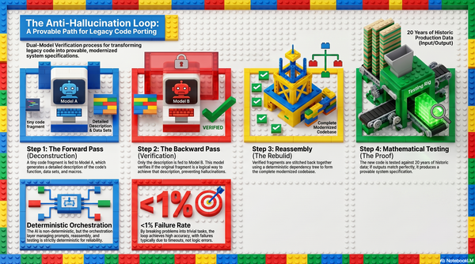</a> | **[The Anti-Hallucination Loop](The_Anti-Hallucination_Loop_Process.png)** A provable path for legacy code porting: the forward pass (deconstruction), the backward pass (verification), reassembly, and mathematical testing &mdash; trapping AI hallucinations to a &lt;1% failure rate. |
| <a href="Provable_High-Accuracy_Code_Migration_Process.png">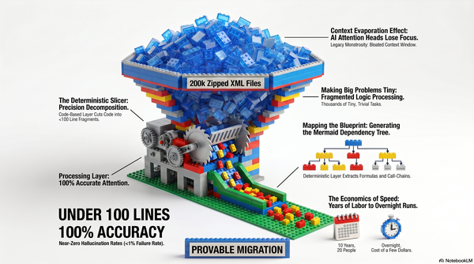</a> | **[Provable High-Accuracy Code Migration Process](Provable_High-Accuracy_Code_Migration_Process.png)** Why dumping 200k zipped XML files into an LLM fails, and how the deterministic slicer cuts code into sub-100-line fragments for 100% accuracy. |
| <a href="Spreadsheet_to_Python_Logic_Transformation.png">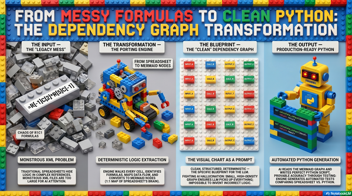</a> | **[From Messy Formulas to Clean Python](Spreadsheet_to_Python_Logic_Transformation.png)** The dependency-graph transformation: messy Excel R1C1 formulas are deterministically parsed into clean Mermaid node charts that serve as the prompts for the AI. |
| <a href="Traditional_vs._Agentic_Porting.png">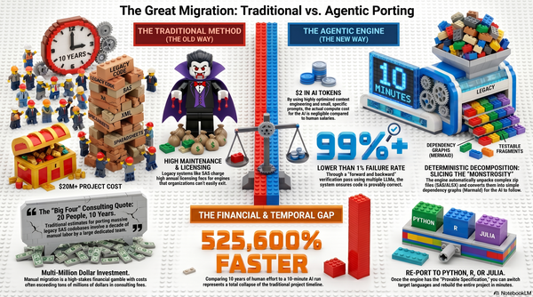</a> | **[The Great Migration: Traditional vs. Agentic Porting](Traditional_vs._Agentic_Porting.png)** A visual comparison of manual human porting versus AI agent porting across cost, speed, and accuracy. |
| <a href="AI_Flipped_Software_Migration_Timeline.png">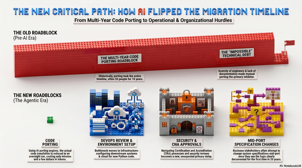</a> | **[The New Critical Path: How AI Flipped the Migration Timeline](AI_Flipped_Software_Migration_Timeline.png)** How the core bottleneck has shifted away from writing code and toward downstream systems, environment setup, and organizational approvals. |
